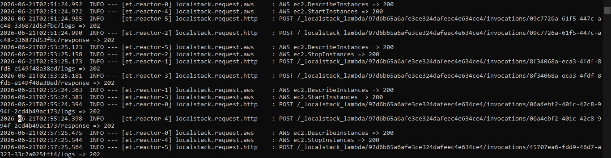

# AWS ec2 Automated COST-Optimization (on/off Schedule)

## Mengapa Proyek Ini Dibuat??

### 1. Masalah (Problem)
* **Pemborosan Biaya**: Banyak server di tahap *Development* menyala sekitar 24/7 jam diluat jam kerja, Hal tersebut memicu pembengkakan tagihan biaya cloud AWS untuk hal yang tidak diperlukan atau sia sia.
* **Kelalaian**: Mematikan server secara manual setiap saat pulang kerja tidak efektif dan sering kali terlupakan.

### 2. Solusi (The Solution)
Membangun sistem *automated scheduler* menggunakan arsitektur *serverless*:
* **AWS CloudWatch Events (EventBridge):** Berfungsi sebagai *cron-job* otomatis untuk memicu tindakan pada jam tertentu (misal: Mati jam 18.00, Menyala jam 06.00).
* **AWS Lambda (Python + Boto3):** Bertindak sebagai otak yang memfilter instance EC2 berdasarkan tag khusus seperti (`AutoStop = True` dan `Environment = Development`) lalu mengubah statusnya (`running` <-> `stopped`).
* **Terraform:** Digunakan untuk mendeklarasikan seluruh infrastruktur tersebut sebagai kode (Infrastructure as Code) agar bisa dideploy secara konsisten dan cepat.
* **LocalStack & Docker:** Digunakan untuk mensimulasikan lingkungan AWS secara lokal tanpa memakan biaya langganan AWS asli.

---

## Arsitektur & Deskripsi Komponen

Sistem ini bekerja dengan alur kerja infrastruktur sebagai berikut:

1. **Pemicu (Trigger):** CloudWatch Rules mengirimkan event terjadwal dengan payload tindakan tertentu (`"action": "start"` atau `"action": "stop"`).
2. **Eksekutor (Lambda):** Fungsi Python menerima payload tersebut, menginisialisasi client `boto3.ec2`, lalu memfilter semua server yang memiliki tag kecocokan.
3. **Target (EC2):** Hanya server dengan tag `AutoStop: True` dan `Environment: Development` yang akan dimatikan atau dinyalakan. Server dengan tag `AutoStop: False`  dan `Environment: Production` akan diabaikan demi keamanan data.

---

## Dampak Bisnis & Efisiensi (Impact)

Dengan menerapkan sistem otomatisasi ini, dampak nyata yang dihasilkan meliputi:

* **Penghematan Biaya:** Jika server Development hanya menyala pada jam kerja (12 jam x 5 hari = 60 jam seminggu) dibandingkan menyala penuh (168 jam seminggu), perusahaan berhasil memotong durasi nyala server sebesar ~108 jam per minggu per server.
* **Zero Operational Overhead:** Tim Engineer tidak perlu lagi mengalokasikan waktu atau pengingat harian hanya untuk mengurus manajemen daya server.

---

---

## Konfigurasi Jadwal (Simulasi vs Production)

* **Jadwal Simulasi Lokal:** Di dalam file `server.tf`, waktu diatur dalam hitungan menit (Mati setiap 2 menit, Nyala setiap 4 menit) agar hasil di LocalStack bisa langsung divalidasi dengan cepat.
* **Implementasi Nyata (Production):** Untuk lingkungan asli AWS dengan jadwal kantor, misal (Mati jam 18.00 WIB, Nyala jam 06.00 WIB), ekspresi CloudWatch menggunakan standar waktu UTC dengan format:
  * **Stop Server (18.00 WIB / 11.00 UTC):** `cron(0 11 ? * MON-FRI *)`
  * **Start Server (06.00 WIB / 23.00 UTC hari sebelumnya):** `cron(0 23 ? * SUN-THU *)`